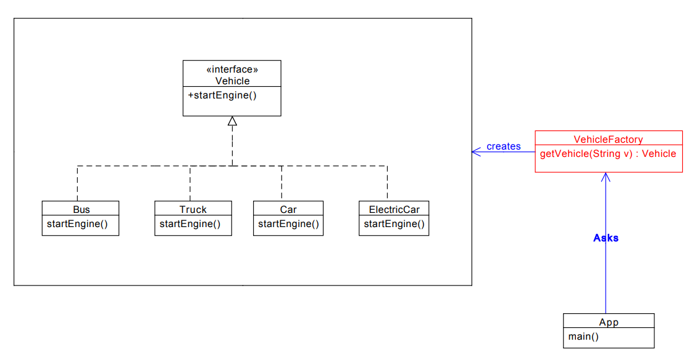

-------------------
| Factory Pattern |
-------------------

Especially useful when it's wise to use **another class to create objects** for the Client class. 

instead of creating objects in clients, directly.
	 
 * The Client shouldn't need to know the details on how to create the objects it needs. 
	
 * The client delicates that responsibility to another class which is called the Factory class.

 * The Factory returns the respective objects that clients is expected.

Main point of a Factory is: 

&nbsp;&nbsp;&nbsp;&nbsp;&nbsp;&nbsp; to know the logic for how to create specific objects (good example is constructors with copmlex logic, no reason to show that to client)

#### UML of this implementation

