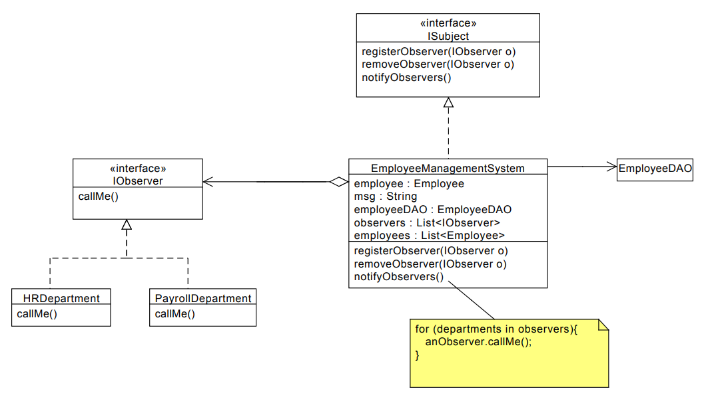

--------------------
| OBSERVER PATTERN |
--------------------

**Is used to notify objects of state changes.**

These objects are interested in changes in another object

* An object called an **Observer** can register to another object
as an interested party. If changes take place in that object, the
observer wants to know about it

* Multiple observers can be registered to the same object &rarr; all would get notifications of changes

* The object the observers register themselves with, is call the **Subject**

* The Subject Object maintains a list of the interested observers and it calls the Observers Objects methods to notify them

* Observer can be an abstract class of interface

#### UML of this implementation

