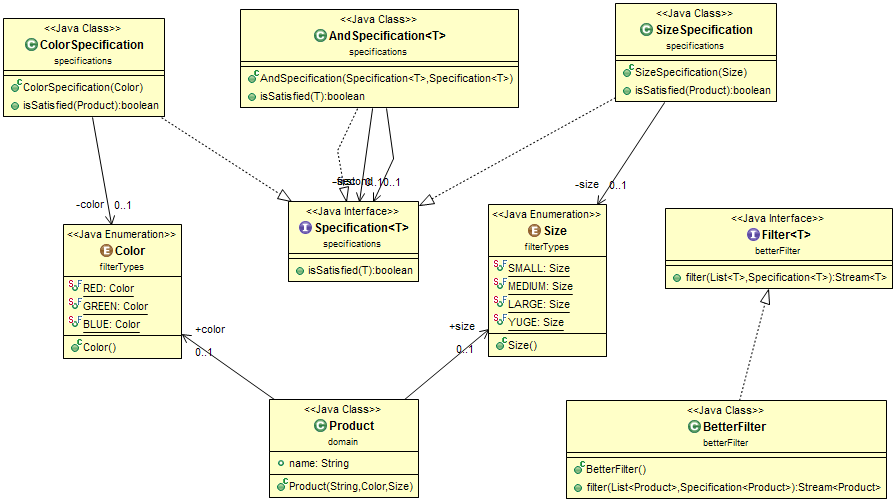

-------------------------------------------------
| Open Close Principle  + Specification Pattern |
-------------------------------------------------

Software Modules (classes, methods...) should be:
* Open for extension
* Close for modification

Code that is already written and tested should not be modified

(clients might have a binary file already, test cases must be modified as well)

Example :
---------
a class *Product* has the variables:

	String name, Enum Color, Enum Size
	
	and a constructor
	
another class *ProductFilter* has the methods:

	filterByColor, filterBySize and filterBySizeAndColor
	
**The problem**: if another variable is added &rarr; ProductFilter will be modified (will obtain another method) &rarr; Violation of OCP

Solution:
--------
Use the Specification Pattern:

1) Create a generic Specification<T> interface which has a method:  
```
boolean isSatisfied(T item);
```
		
2) Create a ColorSpecification class that implements the Specification
 ```
public boolean isSatisfied(Product item) {
  return item.color == color;
}
 ```
 and so on for all the filters..
	
	
3) Create a generic Filter interface that has the method filter:
 ```
Stream<T> filter(List<T> items, Specification <T> spec);
 ```
		
	
 4) Create the BetterFilter class that implements the Filter:
```
public Stream<Product> filter(List<Product> items,
              Specification<Product> spec) {

  return items.stream().filter(p -> spec.isSatisfied(p));
}
 ```
 
 5) Use the BetterFilter
```
BetterFilter bf = new BetterFilter();
System.out.println("Green products (new): ");
bf.filter(products, new ColorSpecification(Color.GREEN))
    .forEach(p -> System.out.println(
        " - " + p.name + " is green"));	
 ```
	
**The Upside** &rarr; No modification of existing classes

Just use of inheritance and implementations of interfaces

#### UML of this example:



